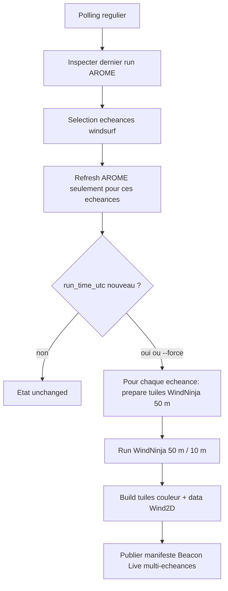

# Moteur autonome de mise a jour AROME -> WindNinja 50 m

## Objectif

Ce moteur surveille regulierement la disponibilite d'une nouvelle prevision AROME Meteo-France. Lorsqu'un nouveau run est detecte, il regenere le produit WindNinja Corse 50 m a 10 m de hauteur pour les echeances utiles a la pratique windsurf, puis publie un manifeste de sortie destine a une integration ulterieure dans Beacon Live.

Le but du produit est de transformer une prevision synoptique AROME en une couche de vent plus exploitable pour la lecture locale des effets de relief, couloirs, accelerations et deventes sur la Corse. Pour l'instant, le moteur ne lance pas les anciennes couches fines Ajaccio/Ricanto et ne gere pas les variantes 100 m ou 1 m.

## Strategie d'echeances

Les couches modele Wind2D et les calculs WindNinja n'ont pas la meme strategie.
Les couches modele doivent permettre la comparaison complete entre modeles :

- AROME : toutes les echeances `H+0..H+48` ;
- MOLOCH : toutes les echeances disponibles dans le bundle source ;
- ICON-2I : toutes les echeances disponibles dans le bundle source ;
- AROME-PI : les prochaines 24 h uniquement, au pas 15 minutes.

WindNinja reste un produit derive couteux. Il garde donc une selection
operationnelle centree sur les heures de session.

Regle WindNinja par defaut :

- aujourd'hui : toutes les heures de `11h` a `17h` locale ;
- demain : heures clefs `11h`, `13h`, `15h`, `17h` locale ;
- les echeances deja passees depuis plus de 1 h sont ignorees ;
- si aucune echeance session n'est disponible, le moteur retombe sur l'echeance AROME la plus proche.

Exemple avec un run AROME `09 UTC` en ete :

```text
run_time_utc = 09:00 UTC = 11:00 locale
H+0  -> 11:00 locale, aujourd'hui
H+1  -> 12:00 locale, aujourd'hui
H+2  -> 13:00 locale, aujourd'hui
...
H+6  -> 17:00 locale, aujourd'hui
H+24 -> 11:00 locale, demain
H+26 -> 13:00 locale, demain
H+28 -> 15:00 locale, demain
H+30 -> 17:00 locale, demain
```

Les tendances semaine restent un produit AROME ou modele grande echelle separe. On ne lance pas WindNinja 50 m sur toute la semaine : ce serait trop couteux et pas assez utile pour la decision de session.

## Pipeline



Le moteur publie maintenant les sorties WindNinja de maniere progressive. Apres chaque echeance terminee, il met a jour les manifests de tuiles couleur/data et reecrit le manifeste Beacon Live avec le statut `partial_updated`. L'application Wind2D peut donc afficher `H+18` des que `H+18` est calcule, meme si `H+20`, `H+22` ou `H+24` tournent encore.

## Detection d'une mise a jour

Le script `scripts/run_forecast_update_engine.py` appelle d'abord le refresh AROME modele :

```bash
python scripts/build_arome_corsica_wind_layer.py \
  --lead-hours 0 1 2 ... 48 \
  --request-sleep-sec 1.3
```

Pour limiter AROME a la fenetre session, on peut encore forcer l'ancien mode :

```bash
python3 scripts/run_forecast_update_engine.py --arome-lead-hour-policy session
```

Le fichier de reference est :

```text
visualizations/wind2d/arome-corsica-latest.json
```

Le moteur lit `run_time_utc` dans ce fichier et le compare a `last_completed_run_time_utc` dans :

```text
data/processed/diagnostics/forecast_update_engine_state.json
```

Si le run AROME est identique, le cycle se termine en `unchanged`. Si le run est nouveau, ou si `--force` est passe, le moteur relance la chaine WindNinja 50 m pour les echeances selectionnees.

## Simulation lancee

Pour chaque echeance selectionnee, la chaine automatique 50 m execute ces etapes :

1. Preparer le plan de tuiles WindNinja 50 m :

```bash
python scripts/prepare_corsica_windninja_tiles.py \
  --cellsize-m 50 \
  --mesh-resolution-m 50 \
  --tile-size-km 20 \
  --overlap-km 2 \
  --output-height-m 10 \
  --lead-hour <LEAD_HOUR> \
  --min-land-fraction 0 \
  --plan-output data/processed/physics/corsica_windninja_tile_plan_50m_h<HH>.json
```

2. Lancer WindNinja en batch avec parallelisation :

```bash
python scripts/run_corsica_windninja_batch.py \
  --plan data/processed/physics/corsica_windninja_tile_plan_50m_h<HH>.json \
  --status-output data/processed/diagnostics/corsica_windninja_50m_batch_status_h<HH>.json \
  --max-runtime-min 60 \
  --parallel 6 \
  --force
```

Le `--force` est volontaire. A chaque nouveau run AROME, on veut recalculer les sorties WindNinja avec le nouveau forcage meteo, meme si des fichiers `_vel.asc` existent deja.

3. Construire les tuiles PNG couleur pour Wind2D :

```bash
python scripts/build_corsica_windninja_raster_tiles.py \
  --plan data/processed/physics/corsica_windninja_tile_plan_50m_h<HH>.json \
  --output-root visualizations/wind2d/windninja-corsica-tiles-50m
```

4. Construire les tuiles data encodant les valeurs brutes pour recolorisation dynamique :

```bash
python scripts/build_corsica_windninja_raster_tiles.py \
  --encoding data \
  --plan data/processed/physics/corsica_windninja_tile_plan_50m_h<HH>.json \
  --output-root visualizations/wind2d/windninja-corsica-data-50m
```

Les tuiles sont rangees par cle d'echeance, par exemple `h00`, `h01`, `h24`. Les manifests `manifest.json` agregent plusieurs steps pour que l'UI puisse basculer d'une heure a l'autre.

A la fin de chaque echeance, le moteur :

- ajoute l'echeance dans `published_windninja_steps` ;
- met `result` a `partial_updated` tant que le batch complet n'est pas termine ;
- reecrit `data/processed/exports/beacon_live/windninja_50m_latest.json` ;
- reecrit `data/processed/diagnostics/forecast_update_engine_status.json`.

Quand toutes les echeances selectionnees sont calculees, le statut final repasse a `updated`.

## Sorties produites

Le manifeste principal pour une integration Beacon Live est :

```text
data/processed/exports/beacon_live/windninja_50m_latest.json
```

Il contient :

- le run AROME source ;
- la resolution WindNinja ;
- la hauteur de sortie ;
- les echeances WindNinja calculees ;
- les chemins vers les manifests de tuiles couleur et data ;
- un resume du dernier cycle de pipeline.

Les fichiers de diagnostic sont :

```text
data/processed/diagnostics/forecast_update_engine_state.json
data/processed/diagnostics/forecast_update_engine_status.json
data/processed/diagnostics/corsica_windninja_50m_batch_status_h<HH>.json
reports/corsica_windninja_50m_automatic_process_h<HH>.md
reports/corsica_windninja_50m_raster_tiles_report_h<HH>.md
reports/corsica_windninja_50m_data_tiles_report_h<HH>.md
```

## Lancer en local

Dry-run, sans appel reseau ni calcul :

```bash
python3 scripts/run_forecast_update_engine.py \
  --once \
  --dry-run \
  --windninja-parallel 6 \
  --windninja-runtime-min 60
```

Cycle reel unique :

```bash
python3 scripts/run_forecast_update_engine.py \
  --once \
  --windninja-parallel 6 \
  --windninja-runtime-min 60
```

Daemon local :

```bash
python3 scripts/run_forecast_update_engine.py \
  --poll-interval-sec 900 \
  --windninja-parallel 6 \
  --windninja-runtime-min 60
```

Le daemon ne depend plus seulement d'un intervalle global. Chaque source meteo
a maintenant son propre etat et sa propre cadence :

```bash
python3 scripts/run_forecast_update_engine.py \
  --arome-poll-interval-sec 900 \
  --aromepi-poll-interval-sec 300 \
  --aromepi-stale-poll-interval-sec 60 \
  --aromepi-freshness-target-sec 900 \
  --aromepi-horizon-hours 24 \
  --fast-window-poll-interval-sec 60 \
  --enable-moloch \
  --moloch-poll-interval-sec 1800 \
  --enable-icon2i \
  --icon2i-poll-interval-sec 1800
```

Par defaut, AROME-PI publie les prochaines 24 h et passe en polling rapide
toutes les 60 secondes lorsque le dernier run vu a plus de 15 minutes. Le but
est de capter rapidement les produits immediats sans relancer WindNinja tant
que le forcage AROME principal n'a pas change.

Le moteur observe egalement les publications reelles. Chaque source conserve un
historique `publication_history` avec :

```json
{
  "run_time_utc": "...",
  "first_seen_at_utc": "...",
  "delay_after_run_sec": 1234,
  "usable_for_schedule": true
}
```

Cet historique sert a estimer la prochaine fenetre rapide. Tant qu'il est
insuffisant, le moteur utilise des profils par defaut :

- AROME : runs `00, 03, 06, 09, 12, 15, 18, 21 UTC` ;
- AROME-PI : runs horaires ;
- MOLOCH : run quotidien `03 UTC`, publication typique plusieurs heures apres ;
- ICON-2I : runs `00 UTC` et `12 UTC`, publication typique quelques heures apres.

Le status expose `publication_schedule` par source avec :

- `latest_expected_run_time_utc` ;
- `next_expected_run_time_utc` ;
- `fast_window_start_utc` / `fast_window_end_utc` ;
- `publication_status`: `on_time`, `waiting_for_expected_run` ou `delayed`.

Pour forcer une liste d'echeances WindNinja :

```bash
python3 scripts/run_forecast_update_engine.py \
  --once \
  --windninja-lead-hours 0 1 2 3 24 26 28 30
```

Pour faire un run de test limite a la fenetre restante aujourd'hui :

```bash
python3 scripts/run_forecast_update_engine.py \
  --once \
  --force \
  --session-days today \
  --session-past-tolerance-hours 0 \
  --windninja-parallel 6 \
  --windninja-runtime-min 60
```

Avec cette option, le moteur ignore demain et ne garde que les echeances de la journee courante encore dans la fenetre `11h-17h`.

## Selection horaire dans Wind2D

Wind2D lit les `steps` exposes par les manifests :

```text
visualizations/wind2d/windninja-corsica-tiles-50m/manifest.json
visualizations/wind2d/windninja-corsica-data-50m/manifest.json
```

La timeline affiche maintenant l'heure locale, le `H+` correspondant et un etat visuel lorsque WindNinja 50 m est disponible pour cette echeance. Si une heure n'a pas encore de tuiles WindNinja, l'utilisateur peut quand meme la selectionner pour voir AROME seul.

Wind2D relit aussi automatiquement le manifest WindNinja 50 m toutes les 45 secondes avec cache-busting. Si une nouvelle echeance vient d'etre publiee par le moteur, la timeline et les boutons de couches se mettent a jour sans recharger la page. L'effet attendu en production est :

- `H+18` apparait des que son calcul est fini ;
- l'utilisateur peut le selectionner pendant que le moteur continue `H+20` ;
- `H+20`, `H+22`, etc. deviennent disponibles au fil de l'eau.

## Lancer en container Docker

Le compose principal est configure pour le mode Portainer sans WindNinja : le
moteur tourne depuis l'image Docker, conserve les donnees dans des volumes
Docker nommes, et ne necessite pas `CORSEWIND_HOST_ROOT`.

Variables attendues dans `.env` :

```bash
METEOFRANCE_API_KEY=...
WINDNINJA_ENABLED=false
```

Commande :

```bash
docker compose -f docker-compose.forecast-engine.yml up --build
```

Les sorties runtime sont conservees dans les volumes Docker nommes
`corsewind-data-raw`, `corsewind-data-processed`, `corsewind-reports`,
`corsewind-tmp` et `corsewind-wind2d`.

Avec Portainer en mode Git stack :

- le stack peut reconstruire l'image depuis le depot a chaque pull ;
- seule la variable `METEOFRANCE_API_KEY` est obligatoire pour le mode sans WindNinja ;
- `WINDNINJA_ENABLED=false` desactive l'execution WindNinja et la generation des tuiles/data WindNinja, tout en conservant la mise a jour des couches modele ;
- le serveur web Wind2D est optionnel : definir `COMPOSE_PROFILES=wind2d-web` pour l'activer, et `WIND2D_WEB_PORT=8769` pour choisir le port hote ;
- le compose ne depend pas d'un fichier `.env` committe ; en local, Docker Compose lit toujours `.env` automatiquement pour l'interpolation ;
- les donnees generees restent dans des volumes Docker nommes, pas dans l'image ;
- lors d'un redeploiement, Portainer envoie `SIGTERM`, le moteur arrete la commande enfant si necessaire, ecrit un statut `stopping` si l'arret tombe au milieu d'une commande, puis relache le lock ;
- le nouveau container reprend depuis `data/processed/diagnostics/forecast_update_engine_state.json`.

Pour reactiver WindNinja plus tard, il faudra utiliser un deploiement avec
`/var/run/docker.sock` et un chemin hote visible par le Docker daemon. Le mode
Portainer-safe actuel evite volontairement ces montages.

Le service web optionnel sert le viewer avec gzip via :

```text
http://<host>:<WIND2D_WEB_PORT>/visualizations/wind2d/
```

Sans `COMPOSE_PROFILES=wind2d-web`, aucun serveur web n'est lance.

Le container expose aussi un healthcheck :

```bash
python scripts/check_forecast_engine_health.py --max-status-age-sec 7200
```

Un echec ponctuel MOLOCH, ICON-2I ou AROME-PI rend le statut degrade mais ne rend pas forcement le container unhealthy. Le healthcheck echoue surtout si le fichier de statut est absent, illisible, trop ancien, ou si le moteur cumule trop d'echecs consecutifs.

Si `WINDNINJA_ENABLED=false`, le cycle finit avec `result = windninja_disabled` lorsqu'un run AROME nouveau attend un calcul WindNinja. Le moteur ne modifie pas le `last_completed_run_time_utc` WindNinja dans cet etat. Quand `WINDNINJA_ENABLED=true` est remis, le dernier run AROME non calcule est donc encore eligible au calcul.

## Cadre operationnel

Configuration par defaut :

- AROME principal : polling toutes les 15 minutes ;
- AROME-PI : polling toutes les 5 minutes quand frais, puis toutes les 60 secondes si le dernier run vu a plus de 15 minutes ;
- MOLOCH et ICON-2I : polling toutes les 30 minutes lorsqu'ils sont actives ;
- backoff par source apres erreur : 5 minutes, puis exponentiel jusqu'a 30 minutes ;
- lead hours AROME modele : `H+0..H+48` par defaut ;
- AROME-PI : prochaines 24 h au pas 15 minutes ;
- mode AROME reduit optionnel : `--arome-lead-hour-policy session` ;
- pause AROME : `1.3 s` apres chaque raster telecharge, pour rester compatible avec le quota API ;
- pause AROME-PI : `1.3 s` apres chaque raster telecharge, necessaire avec l'horizon 24 h pour rester sous un quota de type 50 requetes/minute ;
- selection WindNinja : fenetre windsurf locale `11h-17h`, aujourd'hui horaire, demain toutes les 2 h ;
- produit WindNinja : 50 m, hauteur 10 m ;
- tuiles : 20 km avec 2 km d'overlap ;
- parallelisation : 6 tuiles ;
- budget de calcul : 60 minutes par echeance.

Le budget de 60 minutes s'applique par echeance WindNinja. La strategie par defaut evite donc de calculer toutes les heures sur 48 h. Elle privilegie la fenetre de session utile.

## Limites actuelles

- Le moteur detecte les nouveaux runs via `run_time_utc`, pas via webhook Meteo-France.
- Les etats de publication sont separes par source dans `models.arome`, `models.aromepi`, `models.moloch` et `models.icon2i`.
- Une mise a jour AROME-PI, MOLOCH ou ICON-2I rafraichit les couches Wind2D et leurs `.json.gz`, mais ne relance pas WindNinja.
- WindNinja 50 m est relance uniquement si le run AROME principal differe du dernier run AROME complete par WindNinja, ou si `--force` est passe.
- Il ne lance pas de validation meteorologique automatique contre des stations terrain.
- Il produit uniquement la couche WindNinja 50 m / 10 m pour la fenetre windsurf.
- Les sorties sont pretes pour Beacon Live, mais l'integration directe dans Beacon Live reste une etape separee.
