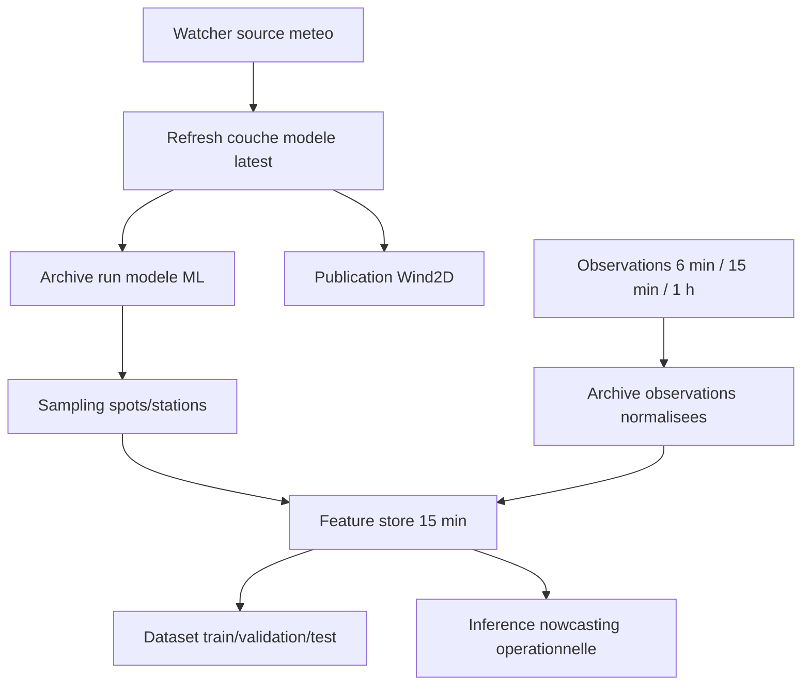

# Dataset Engine Evolution Plan

## Objectif

Faire evoluer le moteur CorseWind actuel pour qu'il ne soit plus seulement un
moteur de publication "latest" pour Wind2D, mais aussi un collecteur historique
capable de construire le dataset ML de nowcasting.

Le moteur doit continuer a faire ce qu'il fait deja :

- watcher AROME, AROME-PI, MOLOCH, ICON-2I ;
- publier les couches Wind2D ;
- compresser les JSON ;
- lancer WindNinja si active ;
- nettoyer les fichiers raw volumineux si `--cleanup-raw` est actif.

Mais il doit aussi conserver ce qui est utile pour entrainer et evaluer les
modeles ML :

- runs modele horodates ;
- echeances prevues ;
- valeurs interpolees aux spots/stations ;
- observations associees ;
- metadonnees de fraicheur, resolution, source et qualite.

## Principe

Le moteur actuel produit des artefacts "latest" :

```text
visualizations/wind2d/arome-corsica-latest.json
visualizations/wind2d/aromepi-corsica-latest.json
visualizations/wind2d/moloch-corsica-latest.json
visualizations/wind2d/icon2i-corsica-latest.json
```

Ces fichiers sont parfaits pour l'affichage, mais insuffisants pour le ML si on
les ecrase a chaque run. La premiere evolution consiste donc a archiver chaque
nouveau run derive dans un stockage historique dedie.

Ce stockage ne remplace pas les raw GRIB/TIFF/NetCDF. Il capture les produits
derivees deja normalises par CorseWind, ce qui permet de garder `--cleanup-raw`
actif sans perdre la capacite de construire un dataset.

## Brique deja implementee

Un script d'archive de snapshot modele a ete ajoute :

```text
scripts/ml_dataset/archive_model_layer_snapshot.py
scripts/ml_dataset/sample_model_layers_at_spots.py
```

Il lit une couche Wind2D modele, valide `run_time_utc` et `forecast_steps`, puis
ecrit :

```text
data/processed/ml_dataset/model_runs/<source>/run_<run_time>/<source>_<run_time>.json.gz
data/processed/ml_dataset/model_runs/<source>/run_<run_time>/summary.json
data/processed/ml_dataset/model_runs/<source>/latest.json
```

Le moteur peut l'appeler avec :

```bash
python3 scripts/run_forecast_update_engine.py \
  --enable-ml-dataset-archive
```

Option de sortie :

```bash
--ml-dataset-root data/processed/ml_dataset/model_runs
--ml-dataset-samples-root data/processed/ml_dataset/model_samples
```

Variable d'environnement equivalente :

```bash
ML_DATASET_ARCHIVE_ENABLED=true
```

Cette brique est volontairement conservative :

- elle archive les JSON derives, pas les raw lourds ;
- elle echantillonne les couches derivees aux spots ML ;
- elle est idempotente par `source + run_time_utc` ;
- elle ne bloque pas le moteur si elle est desactivee ;
- elle peut coexister avec `--cleanup-raw`.

## Architecture cible



## Inventaire sources externes

Inventaire detaille des sources, API, acces requis et priorites :

```text
docs/ml_nowcasting/external_data_sources_inventory.md
docs/ml_nowcasting/missing_access_api_call_structures.md
```

Decision principale :

- P0 : observations Beacon Live, observations Meteo-France, AROME/AROME-PI ;
- P1 : rayonnement/ensoleillement, pression/gradients, SST Copernicus Marine
  desormais collectable, topographie IGN ;
- P2 : courants/vagues/mixed layer Copernicus uniquement si gain mesure,
  satellite nuages EUMETSAT, radar pluie/convection, ECMWF open data ;
- P3 : ERA5/CDS pour historique long.

Copernicus Marine est separe en deux niveaux :

- `collect_copernicus_marine_sst.py` produit maintenant les samples SST aux
  spots et devient une source P1 du dataset ;
- `inventory_copernicus_marine_products.py` suit les candidats ocean courant,
  mixed layer, vagues et vent mer, mais ces champs ne doivent etre ajoutes au
  training qu'apres un test d'ablation.

## Source canonique Beacon Live

Le projet Beacon Live contient deja deux actifs a reutiliser :

```text
/Users/arnaud/Documents/beacon-live-app/src/config/sources.js
/Users/arnaud/Documents/beacon-live-app/data/weather-state.json
```

`sources.js` est la source canonique pour :

- les spots/stations ;
- les coordonnees GPS ;
- les identifiants amont Meteo-France, WindsUp, Wunderground, eSurfmar,
  Pioupiou et CANDHIS.

`weather-state.json` est la source de bootstrap pour :

- le dernier snapshot live ;
- les observations recentes ;
- l'etat de sante des sources ;
- les timestamps `observedAt` et `receivedAt`.

CorseWind ne doit pas recopier manuellement cette liste. Il importe un registry
ML depuis Beacon Live.

Scripts ajoutes :

```text
scripts/ml_dataset/import_beacon_live_spots.py
scripts/ml_dataset/import_beacon_live_observations.py
scripts/ml_dataset/collect_meteo_france_observations.py
scripts/ml_dataset/inventory_meteo_france_wcs_variables.py
scripts/ml_dataset/sample_model_layers_at_spots.py
scripts/ml_dataset/profile_data_availability.py
```

Importer le registry spots/stations :

```bash
python3 scripts/ml_dataset/import_beacon_live_spots.py \
  --beacon-root /Users/arnaud/Documents/beacon-live-app \
  --output configs/ml_spots.json
```

Importer un snapshot d'observations Beacon Live vers le format ML normalise :

```bash
python3 scripts/ml_dataset/import_beacon_live_observations.py \
  --weather-state /Users/arnaud/Documents/beacon-live-app/data/weather-state.json \
  --registry configs/ml_spots.json \
  --output-root data/processed/ml_dataset/observations/beacon_live
```

Les vents Beacon Live sont normalises en m/s dans CorseWind. Beacon Live expose
les valeurs live principalement en noeuds pour l'UI.

Collecter les observations Meteo-France deja accessibles :

```bash
python3 scripts/ml_dataset/collect_meteo_france_observations.py \
  --mode station-6m \
  --mode station-hourly \
  --mode synop \
  --mode bouees \
  --output-root data/processed/ml_dataset/observations/meteo_france
```

Inventorier les variables AROME/AROME-PI WCS disponibles pour le ML :

```bash
python3 scripts/ml_dataset/inventory_meteo_france_wcs_variables.py \
  --output data/processed/ml_dataset/source_inventories/meteo_france_wcs_variables.json
```

Collecter les champs AROME/AROME-PI utiles au ML au-dela du vent :

```bash
python3 scripts/ml_dataset/collect_meteo_france_nwp_spot_features.py \
  --source arome \
  --input visualizations/wind2d/arome-corsica-latest.json \
  --max-steps 24 \
  --include-context-spots

python3 scripts/ml_dataset/collect_meteo_france_nwp_spot_features.py \
  --source aromepi \
  --input visualizations/wind2d/aromepi-corsica-latest.json \
  --max-steps 24 \
  --include-context-spots
```

Collecter les profils verticaux AROME 0.025 sur niveaux isobares :

```bash
python3 scripts/ml_dataset/collect_meteo_france_vertical_profiles.py \
  --input visualizations/wind2d/arome-corsica-latest.json \
  --max-steps 5 \
  --pressure-level-hpa 1000 \
  --pressure-level-hpa 925 \
  --pressure-level-hpa 850 \
  --include-context-spots
```

Echantillonner une couche modele aux spots :

```bash
python3 scripts/ml_dataset/sample_model_layers_at_spots.py \
  --source aromepi \
  --input visualizations/wind2d/aromepi-corsica-latest.json \
  --output-root data/processed/ml_dataset/model_samples
```

Profiler les donnees actuellement disponibles :

```bash
python3 scripts/ml_dataset/profile_data_availability.py
```

Le rapport lisible est ecrit dans :

```text
docs/ml_nowcasting/data_availability_profile.md
```

Construire la premiere feature store 15 min :

```bash
python3 scripts/ml_dataset/build_spot_feature_store.py
```

Ou la reconstruire automatiquement en fin de cycle moteur :

```bash
python3 scripts/run_forecast_update_engine.py --enable-ml-feature-store
```

Sorties :

```text
data/processed/ml_dataset/feature_store/spot_forecast_15min.jsonl
data/processed/ml_dataset/feature_store/spot_forecast_15min_profile.json
docs/ml_nowcasting/feature_store_schema.md
```

## Source Meteo-France observations

Inventaire detaille :

```text
docs/ml_nowcasting/meteo_france_observation_api_inventory.md
```

Decision d'ingestion :

- utiliser `DPPaquetObs /paquet/stations/infrahoraire-6m` comme collecte bulk
  6 min principale ;
- utiliser `DPPaquetObs /paquet/infrahoraire-6m` pour rattrapage 24 h par
  station ;
- utiliser `DPPaquetObs /paquet/stations/horaire` pour le bulk horaire ;
- utiliser `DPObs /synop` pour pression/tendance/nuages/pluie enrichis ;
- utiliser `DPObs /bouees` pour mer/houle/temperature mer.

## Source Meteo-France radar

Inventaire detaille :

```text
docs/ml_nowcasting/meteo_france_radar_api_inventory.md
```

Decision d'ingestion :

- utiliser `DPPaquetRadar /mosaique/paquet` comme source prioritaire radar ;
- extraire les fichiers HDF5 `IPRN20`, qui couvrent la metropole et la Corse ;
- echantillonner la quantite `ACRR` et la qualite `QIND` autour de chaque
  spot ;
- construire des features pluie/convection a 5, 15, 30 et 60 min ;
- garder les paquets radar individuels Ajaccio/Aleria (`id_station=37` et
  `id_station=61`) en phase 2 seulement, car ils demandent un decodage BUFR.

Le radar ne mesure pas le vent au spot. Il sert de contexte pour expliquer les
regimes perturbes : averses, fronts, grains, rafales descendantes, bascules
rapides ou journees thermiques cassees par la convection.

## Donnees a conserver

### Niveau 1 : runs modele normalises

Deja amorce avec l'archive des snapshots.

Contenu :

- source : `arome`, `aromepi`, `moloch`, `icon2i` ;
- run_time_utc ;
- generated_at_utc ;
- valid_time_utc par echeance ;
- lead hour / lead minutes ;
- grille normalisee ;
- speed/u/v/gust si disponibles ;
- bbox et metadonnees de grille ;
- source_file/dataset_id si disponibles.

### Niveau 2 : valeurs modele aux spots/stations

Statut : demarree.

Objectif : eviter de relire de gros grids pour chaque entrainement. Pour chaque
run modele et chaque spot/station cible, extraire :

- vitesse modele ;
- rafale modele si disponible ;
- u/v modele ;
- direction derivee ;
- valid_time_utc ;
- lead_time_minutes ;
- source_resolution_minutes ;
- run_age_minutes au moment d'usage ;
- indicateur interpolation/sampling.

Sortie cible :

```text
data/processed/ml_dataset/model_samples/source=<source>/date=YYYY-MM-DD/*.parquet
```

Format logique :

```text
spot_id
source
run_time_utc
valid_time_utc
lead_time_minutes
variable
value
unit
source_resolution_minutes
sample_method
```

Implementation actuelle :

- script `scripts/ml_dataset/sample_model_layers_at_spots.py` ;
- interpolation bilineaire par defaut ;
- sortie JSONL large par `source/date` ;
- variables extraites : vitesse, u/v, direction derivee, rafale si presente ;
- integration au moteur quand `--enable-ml-dataset-archive` est actif.

### Niveau 3 : observations normalisees

Les observations peuvent arriver en 6 min, 15 min ou 1 h. Il faut conserver le
brut normalise, puis produire une vue 15 min.

Brut normalise :

```text
data/processed/ml_dataset/observations/raw_normalized/source=<source>/date=YYYY-MM-DD/*.parquet
```

Vue operationnelle 15 min :

```text
data/processed/ml_dataset/observations/15min/date=YYYY-MM-DD/*.parquet
```

Colonnes candidates :

```text
station_id
timestamp_utc
source
source_resolution_minutes
wind_mean_ms
gust_ms
wind_dir_deg
temperature_c
pressure_hpa
humidity_pct
solar_wm2
rain_mm
quality_flags
observed_at_utc
ingested_at_utc
```

Agregations 6 min -> 15 min :

- derniere valeur ;
- moyenne ;
- min/max ;
- rafale max ;
- ecart-type ;
- tendance ;
- rotation de direction ;
- nombre de points ;
- age de derniere observation.

### Niveau 4 : feature store 15 min

Produit final pour entrainement et inference.

```text
data/processed/ml_dataset/features_15min/date=YYYY-MM-DD/*.parquet
```

Chaque ligne represente :

```text
spot_id + forecast_issue_time_utc + target_valid_time_utc + horizon_minutes
```

Elle contient :

- observations passees disponibles a `forecast_issue_time_utc` ;
- features derivees ;
- previsions NWP futures connues a ce moment ;
- metadonnees spot ;
- cible observee si elle est deja disponible ;
- flags de qualite et de disponibilite.

## Point d'integration dans le moteur

Le bon point d'accroche est juste apres `refresh_source(...)`.

Cycle actuel simplifie :

```text
poll source
refresh source latest JSON
eventuellement cleanup raw
compresser latest JSON
publier Wind2D / WindNinja
```

Cycle cible :

```text
poll source
refresh source latest JSON
archive snapshot ML du run
sample spots/stations pour ce run
eventuellement cleanup raw
compresser latest JSON
publier Wind2D / WindNinja
```

Pour les observations, le watcher pourra etre un flux independant mais il doit
ecrire dans le meme espace `data/processed/ml_dataset`.

Les collectes externes a cadence propre sont rattachees au meme moteur via
`external_data` dans l'etat JSON. EUMETSAT Cloud Mask est la premiere source de
ce type :

```bash
python3 scripts/run_forecast_update_engine.py \
  --enable-ml-eumetsat-cloud-mask \
  --ml-eumetsat-cloud-mask-poll-interval-sec 480 \
  --ml-eumetsat-cloud-mask-window-minutes 120
```

Cette collecte n'attend pas un nouveau run AROME : le moteur peut se reveiller
sur la prochaine echeance EUMETSAT si elle arrive avant la prochaine echeance
meteo. Les samples sont deduplicates par `product_id + spot_id`.

Les produits thermiques/convection ajoutes apres Cloud Mask utilisent le meme
rail via `scripts/ml_dataset/collect_eumetsat_spot_product.py` :

```bash
python3 scripts/run_forecast_update_engine.py \
  --enable-ml-eumetsat-thermal-products \
  --ml-eumetsat-thermal-poll-interval-sec 900 \
  --ml-eumetsat-thermal-window-minutes 180
```

Produits integres :

- Cloud Type `EO:EUM:DAT:0680` ;
- Land Surface Temperature `EO:EUM:DAT:1088` ;
- Global Instability Indices `EO:EUM:DAT:0683`.

Les champs AROME/AROME-PI extra suivent un rail different : ils dependent du
run modele publie et sont collectes juste apres le refresh de la source
correspondante. Activation :

```bash
python3 scripts/run_forecast_update_engine.py \
  --enable-ml-nwp-extra-fields \
  --ml-nwp-extra-fields-max-steps 24
```

Objectif ML : ajouter aux samples vent des variables qui expliquent les
journees thermiques mal capturees par le vent seul. Les familles retenues sont
temperature, point de rosee, humidite, pression, nebulosite, rayonnement,
couche limite et instabilite. Les fichiers de sortie restent separes des JSON
Wind2D :

```text
data/processed/ml_dataset/meteo_france_nwp/extra_field_samples
data/processed/ml_dataset/meteo_france_nwp/raw/extra_fields
```

Les profils verticaux AROME 0.025 ajoutent une coupe de la colonne d'air au
point. Ils echantillonnent temperature, humidite, vitesse verticale pression,
geopotentiel/hauteur et temperature pseudo-adiabatique potentielle sur des
niveaux isobares configurables. Ils derivent ensuite des features thermiques
compactes : epaisseur `1000-850 hPa`, lapse rate, humidite moyenne basse couche,
omega 850 hPa et inversion basse couche.

Activation conservative :

```bash
python3 scripts/run_forecast_update_engine.py \
  --enable-ml-nwp-vertical-profiles \
  --ml-nwp-vertical-profiles-max-steps 5 \
  --ml-nwp-vertical-profiles-pressure-levels-hpa 1000 925 850
```

## Retention

Les raw meteo volumineux peuvent rester temporaires.

Conserver long terme :

- snapshots JSON normalises gzip ;
- samples par spot/station ;
- observations normalisees ;
- features 15 min ;
- manifests et summaries.

Supprimer ou limiter :

- TIFF/GRIB/NetCDF raw telecharges ;
- tuiles raster ;
- rapports temporaires ;
- caches intermediaires.

## Phases d'implementation

### Phase 1 : archive model-run

Statut : demarree.

Fait :

- script `archive_model_layer_snapshot.py` ;
- script `sample_model_layers_at_spots.py` ;
- option moteur `--enable-ml-dataset-archive` ;
- option moteur `--ml-dataset-root` ;
- option moteur `--ml-dataset-samples-root` ;
- dry-run moteur valide ;
- tests manuels AROME et AROME-PI valides.

Reste :

- tester en cycle reel ;
- activer en production apres verification espace disque ;
- ajouter monitoring simple du nombre de runs archives.

### Phase 1b : collecte satellite EUMETSAT Cloud Mask

Statut : demarree.

Fait :

- script `scripts/ml_dataset/collect_eumetsat_cloud_mask.py` ;
- credentials EUMETSAT testes OK, non persistants ;
- collecte testee sur 6 produits MTG NRT, 25 spots, 150 lignes ;
- scan catalogue global EUMETSAT ajoute ;
- option moteur `--enable-ml-eumetsat-cloud-mask` ;
- cadence moteur `--ml-eumetsat-cloud-mask-poll-interval-sec`, defaut 480 s ;
- fenetre glissante `--ml-eumetsat-cloud-mask-window-minutes`, defaut 120 min ;
- collecteur generique `collect_eumetsat_spot_product.py` ;
- option moteur `--enable-ml-eumetsat-thermal-products` ;
- Cloud Type, Land Surface Temperature et Global Instability Indices raccordes ;
- status moteur `eumetsat_cloud_mask` ;
- etats moteur `external_data.eumetsat_cloud_mask`,
  `external_data.eumetsat_cloud_type`,
  `external_data.eumetsat_land_surface_temperature`,
  `external_data.eumetsat_global_instability_indices`.

Reste :

- confirmer officiellement le mapping des valeurs `cloud_state` ;
- confirmer les noms de variables NetCDF reellement exposes par Cloud Type,
  Land Surface Temperature et GII sur plusieurs produits ;
- definir retention des NetCDF bruts.

### Phase 1c : champs AROME/AROME-PI extra pour ML

Statut : demarree.

Fait :

- script `scripts/ml_dataset/collect_meteo_france_nwp_spot_features.py` ;
- echantillonnage spot des champs WCS extra sans alourdir les JSON Wind2D ;
- champs AROME : temperature 2 m, point de rosee 2 m, humidite 2 m, pression
  mer/surface, nebulosite basse/totale, couche limite, CAPE, rayonnement court ;
- champs AROME-PI : temperature 2 m, point de rosee 10 m, humidite 10 m,
  pression mer, nebulosite, rayonnement court descendant/direct/ciel clair ;
- conversion pression Pa -> hPa ;
- conversion rayonnement accumule J/m2 -> W/m2 selon le pas source ;
- option moteur `--enable-ml-nwp-extra-fields` ;
- tests reels AROME et AROME-PI valides sur 25 spots.

Reste :

- laisser tourner sur plusieurs runs pour mesurer la disponibilite exacte par
  echeance et par champ ;
- ajouter les jointures feature-store avec les samples vent et observations ;
- decider la retention des TIFF bruts telecharges.

### Phase 1d : profils verticaux AROME 0.025

Statut : demarree.

Fait :

- script `scripts/ml_dataset/collect_meteo_france_vertical_profiles.py` ;
- validation WCS `pressure(...)` avec sortie GeoTIFF ;
- echantillonnage spot des niveaux isobares AROME 0.025 ;
- variables verticales : temperature, humidite, vitesse verticale pression,
  geopotentiel/hauteur, temperature pseudo-adiabatique potentielle ;
- features derivees : epaisseur geopotentielle `1000-850 hPa`, lapse rate,
  humidite basse couche, omega 850 hPa, inversion basse couche ;
- option moteur `--enable-ml-nwp-vertical-profiles` ;
- integration au profil de disponibilite.

Reste :

- mesurer le cout API sur plusieurs runs avant d'elargir niveaux/echeances ;
- tester les niveaux `950, 900, 800, 750, 700 hPa` sur plusieurs jours ;
- comparer le gain ML des profils bruts vs features derivees compactes.

### Phase 1e : feature store 15 min

Statut : demarree.

Fait :

- script `scripts/ml_dataset/build_spot_feature_store.py` ;
- grain canonique `spot_id + target_time_utc` au pas 15 min ;
- targets depuis observations normalisees ;
- jointures exactes modele/NWP sur l'heure de validite ;
- jointures as-of SST, Cloud Mask et observations recentes ;
- features de tendance observation 15 min / 60 min ;
- schema Markdown et profil JSON de couverture ;
- integration au rapport de disponibilite.

Reste :

- remplir plus d'observations historiques pour augmenter le nombre de lignes ;
- faire tourner les collecteurs sur plusieurs jours pour obtenir un vrai
  recouvrement observations/modeles/satellite ;
- exporter une version Parquet quand le schema se stabilise ;
- entrainer le premier baseline ML sur cette table.

### Phase 2 : registry spots/stations

Creer ou mettre a jour un fichier de configuration versionne :

```text
configs/ml_spots.json
```

Statut : demarree via import Beacon Live.

Contenu :

- spot_id ;
- nom ;
- latitude ;
- longitude ;
- beacon_source_id ;
- station_id amont ;
- type de source ;
- resolution source estimee ;
- flag `use_for_ml`.

Reste a enrichir manuellement ou via produit :

- orientation spot ;
- seuils windsurf ;
- groupe metier ;
- station cible vs station contexte ;
- qualite attendue par source.

### Phase 3 : sampler modele -> spots

Creer un script :

```text
scripts/sample_model_runs_for_ml_dataset.py
```

Il lit les snapshots archives et produit des Parquet de valeurs aux spots.

### Phase 4 : ingestion observations

Creer une couche d'entree observations avec contrat clair.

Statut : bootstrap JSONL depuis `weather-state.json` Beacon Live disponible.

Au depart, accepter le fichier persiste par Beacon Live :

```text
/Users/arnaud/Documents/beacon-live-app/data/weather-state.json
```

Ensuite, brancher une synchronisation continue :

- lecture periodique du fichier persiste ;
- ou consommation de `/api/weather` et `/api/events` si le backend Beacon Live
  tourne ;
- ou partage d'un volume Docker entre `weather-api` et CorseWind.

### Phase 5 : builder features 15 min

Creer :

```text
scripts/build_ml_feature_store.py
```

Il assemble :

- observations 6/15/1 h ;
- agregations 15 min ;
- NWP samples ;
- metadonnees spot ;
- cibles observees ;
- horizons.

### Phase 6 : baselines et modeles

Creer :

```text
scripts/train_ml_nowcasting_baselines.py
scripts/run_ml_nowcasting_benchmark.py
```

Ordre :

1. persistance ;
2. NWP brut ;
3. LightGBM/XGBoost ;
4. TTM ;
5. Chronos-2.

## Decisions actuelles

1. Le moteur doit archiver les produits normalises, pas forcement les raw.
2. `--cleanup-raw` peut rester active si l'archive ML est active.
3. Le pas de feature store principal est 15 min.
4. Le 6 min reste une source d'agregations fines.
5. Les sources horaires restent marquees avec age/resolution/lead time.
6. Aucune observation future ne doit entrer dans les features.
7. Le ML ne doit jamais casser la publication Wind2D : en cas d'echec archive
   ou dataset, le moteur doit signaler l'erreur mais conserver les couches
   meteo operationnelles.
